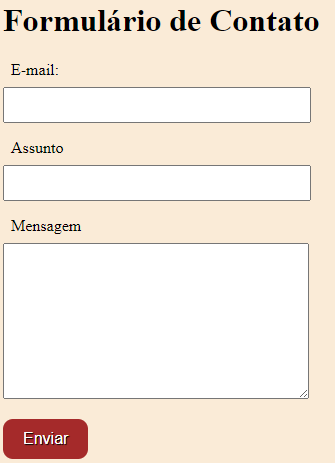

# índice

* [Formulário de Contato](#form-contato)
* [Descrição](#descrição)
* [Introdução](#introdução)
* [Funcionalidades](#funcionalidades)
* [Tecnologias Utilidades](#tecnologias-utilizadas)
* [Fontes Consultadas](#fontes-consultadas)
* [Autores](#autores)

# Formulário de Contato

## Descrição 📖
- Este projeto é um formulário de contato básico em HTML, criado como parte de um exercício de prática. Ele permite que os usuários preencham informações e enviem mensagens através do formulário. É uma ótima maneira de aprender os conceitos básicos de criação de formulários em HTML.

## Introdução ✉️
- Preenchimento de dados em um formulário de contatos  

## Funcionalidades 🧠
- Aprender a construir uma tabela de formulário de contato

## Tecnologias Utilizadas 🖥️
- Visual Studio Code
- CSS3
- HTML 5
- mdn_
- Github

## Fontes Consultadas 🔗
- [mdn web docs_](https://developer.mozilla.org)

## Autores 👥
- [João Pedro Gonçalves](https://github.com/s-pedro13)
- [Nicolas Tonassi](https://github.com/nicolas-tonassi)